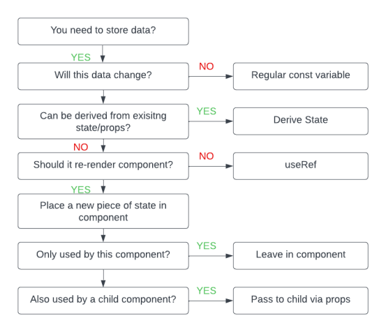

__Article Link:__ https://www.freecodecamp.org/news/react-state-management/ 
# What is State?
- State is a dynamic data storage that provides a mechanism for components to manage, keep track of changing data, and trigger re-rendering when it is updated.

# When to use State
- When there is a need to get data that has to be updated inside of a component, we use state.
- Any update to the data will cause the component to re-render.
- The useState functions consist of a destructuring assignment that extracts values from an array or properties from an object.

# Where to use State
__Global State__

- These are states that are accessible to every component in the application. It is always declared and located in the root component of your app before the JSX is returned.
 - A state can be considered as a global state if it is a piece of data that is accessible among multiple components thereby, aiding communication between components in the application.

__Local State__

- Local states are located within the parent components in an application. They are only needed and can be accessed in the component.
 - Using local state, components can independently change and handle their data which leads to partitioning within the application.

__Visual Representation__
